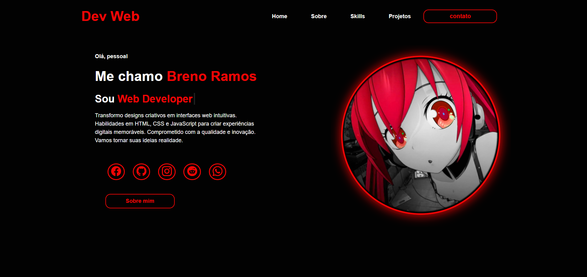

# 💼 Modelo de Portfólio Pessoal 🌐

"Um cartão de visita digital construído com código."

📖 Sobre o projeto

Este projeto foi desenvolvido durante meus estudos de HTML e CSS, com o objetivo de praticar e aprofundar meus conhecimentos em criação de páginas estáticas e estilização web.

O Modelo de Portfólio Pessoal é um site que apresenta:

Um resumo sobre mim

Algumas habilidades

Estrutura pensada para servir como base para futuros portfólios reais

---

🔗 [**Acesse o site aqui**](https://brenojramos.github.io/Portifolio-Breno/)

🛠️ Tecnologias utilizadas

HTML5 → Estrutura semântica da página

CSS3 → Estilos visuais e responsividade

---

🎯 Objetivos de aprendizagem

Criar um modelo de portfólio online

Explorar o uso de CSS para layouts modernos

Trabalhar conceitos de responsividade

Aprender a estruturar uma página focada em apresentação pessoal

---

✨ Funcionalidades

Sessão Sobre mim com breve descrição

Lista de habilidades em destaque

Layout simples, elegante e responsivo

Modelo pronto para ser expandido com projetos futuros

  

